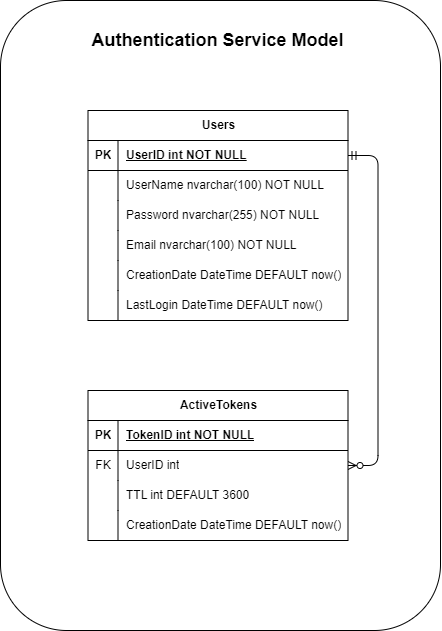

# UserDB Setup Guide

This repository contains the SQL scripts needed to set up the `UserDB` database, including creating tables and loading sample data.

## Prerequisites

- MySQL or a compatible SQL server
- Access to a MySQL client (e.g., MySQL Workbench, command-line client)

## Database Setup

### Step 1: Clone the Repository

Begin by cloning the repository to your local environment:

```bash
git clone https://github.com/W4153WASMCoder/UserDB.git
cd UserDB/src
```

### Step 2: Create the Database

Log into your MySQL server and create a new database for the user data. Replace `db_user` with your preferred database name if desired.

```sql
mysql -u root -p
CREATE DATABASE db_user;
USE db_user;
```

### Step 3: Run the SQL Scripts

With the `db_user` database selected, run the provided SQL scripts to create tables and insert dummy data.

1. **Create Tables**: Execute `create-table.sql` to create the necessary tables.

   ```bash
   mysql -u root -p db_user < create-table.sql
   ```

2. **Insert Dummy Data**: Run `dummy-data.sql` to populate the database with sample data for testing purposes.

   ```bash
   mysql -u root -p db_user < dummy-data.sql
   ```

### Step 4: Verify the Setup

To confirm that the tables and data were created successfully, you can run the following query to see the tables:

```sql
SHOW TABLES;
```

And to view the data in a specific table:

```sql
SELECT * FROM <table_name>;
```

Replace `<table_name>` with the actual table name you wish to inspect.

## Additional Notes

- Make sure to update any services or applications that connect to this database with the correct database name, user, and password.
- For security, it is recommended to create a dedicated MySQL user with limited privileges to access this database instead of using the root user.

---

This setup guide should help you initialize and verify the `UserDB` database quickly. If you need to make changes to the schema or sample data, you can modify the SQL files before executing them.

---


